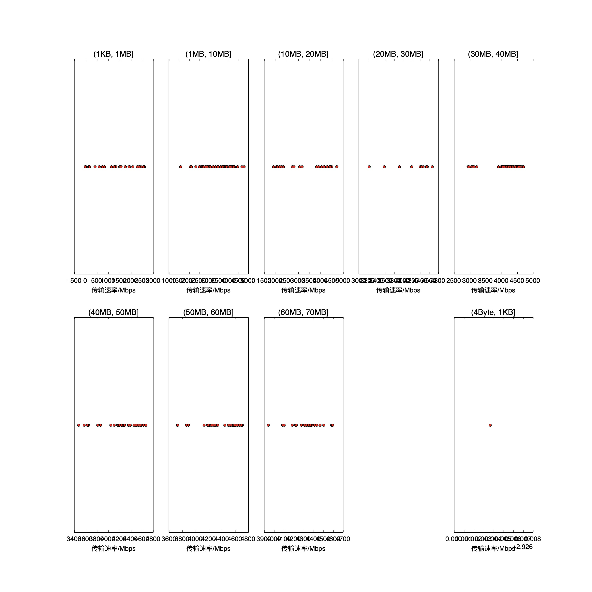

|   |个数|速率/Mbps|时间/s|时间占比|
|---|---|---|---|---|
|4Byte|200|0.00|0.00|0.00%|
|(4Byte, 1KB]|1|2.93|0.00|0.01%|
|(1KB, 1MB]|69|1090.95|0.23|0.81%|
|(1MB, 10MB]|126|3757.19|2.69|9.57%|
|(10MB, 20MB]|30|3644.49|1.46|5.18%|
|(20MB, 30MB]|12|4257.87|0.76|2.69%|
|(30MB, 40MB]|78|4216.17|7.03|24.97%|
|(40MB, 50MB]|45|4286.10|5.62|19.97%|
|(50MB, 60MB]|45|4422.53|6.63|23.57%|
|(60MB, 70MB]|23|4334.36|3.73|13.24%|

