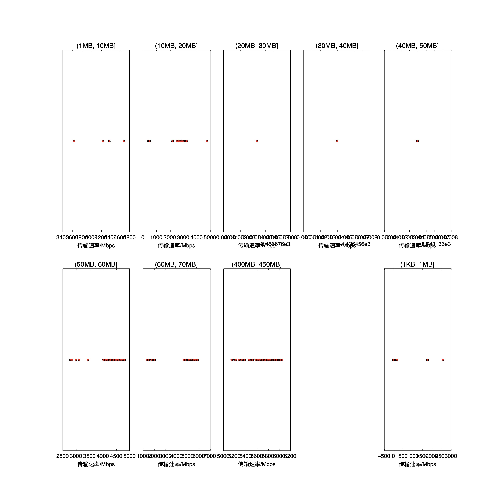

|   |个数|速率/Mbps|时间/s|时间占比|
|---|---|---|---|---|
|4Byte|200|0.00|0.00|0.00%|
|(1KB, 1MB]|251|192.04|6.00|3.96%|
|(1MB, 10MB]|6|4309.40|0.07|0.04%|
|(10MB, 20MB]|101|1582.39|24.58|16.20%|
|(20MB, 30MB]|1|2456.68|0.13|0.09%|
|(30MB, 40MB]|1|4426.46|0.08|0.05%|
|(40MB, 50MB]|1|2743.14|0.20|0.13%|
|(50MB, 60MB]|98|4330.74|15.40|10.16%|
|(60MB, 70MB]|100|4168.20|23.98|15.81%|
|(400MB, 450MB]|100|5800.89|81.23|53.56%|

