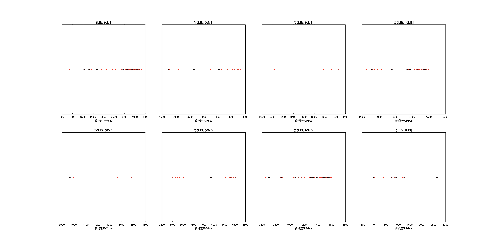

|   |个数|速率/Mbps|时间/s|时间占比|
|---|---|---|---|---|
|4Byte|200|0.00|0.00|0.00%|
|(1KB, 1MB]|14|573.73|0.04|0.14%|
|(1MB, 10MB]|97|3748.01|1.96|6.98%|
|(10MB, 20MB]|17|3558.87|0.79|2.81%|
|(20MB, 30MB]|4|3853.17|0.29|1.03%|
|(30MB, 40MB]|97|4160.17|8.40|29.96%|
|(40MB, 50MB]|4|4204.88|0.51|1.83%|
|(50MB, 60MB]|12|4064.64|1.92|6.85%|
|(60MB, 70MB]|83|4417.79|14.13|50.39%|

