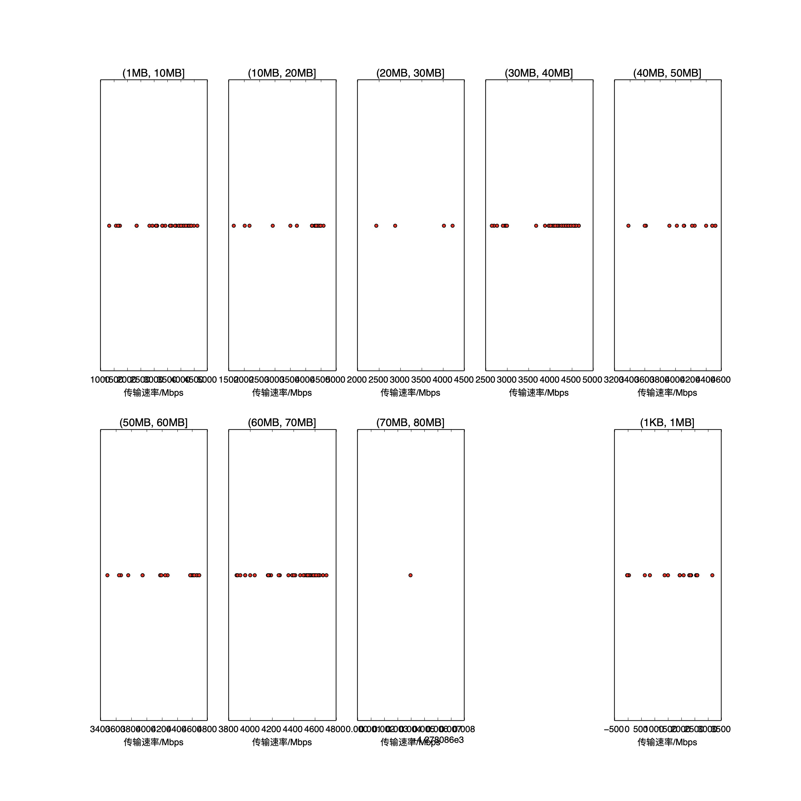

|   |个数|速率/Mbps|时间/s|时间占比|
|---|---|---|---|---|
|4Byte|200|0.00|0.00|0.00%|
|(1KB, 1MB]|37|1627.87|0.14|0.51%|
|(1MB, 10MB]|56|3658.00|1.09|3.94%|
|(10MB, 20MB]|32|4054.76|1.26|4.54%|
|(20MB, 30MB]|4|3401.38|0.35|1.28%|
|(30MB, 40MB]|87|4267.63|7.91|28.53%|
|(40MB, 50MB]|15|4121.99|1.90|6.84%|
|(50MB, 60MB]|27|4356.69|4.04|14.57%|
|(60MB, 70MB]|66|4445.34|10.84|39.11%|
|(70MB, 80MB]|1|4278.09|0.19|0.68%|

