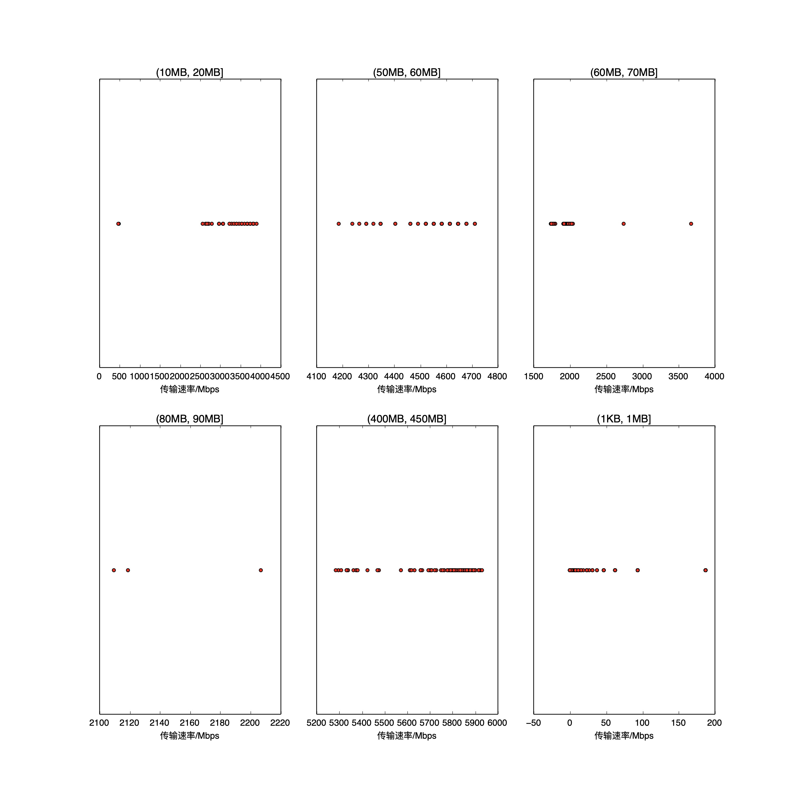

|   |个数|速率/Mbps|时间/s|时间占比|
|---|---|---|---|---|
|4Byte|200|0.00|0.00|0.00%|
|(1KB, 1MB]|182|52.56|1.00|0.70%|
|(10MB, 20MB]|97|3559.91|5.76|4.03%|
|(50MB, 60MB]|100|4564.41|14.77|10.34%|
|(60MB, 70MB]|97|1972.10|38.05|26.63%|
|(80MB, 90MB]|3|2145.29|1.34|0.94%|
|(400MB, 450MB]|100|5744.81|81.96|57.37%|

