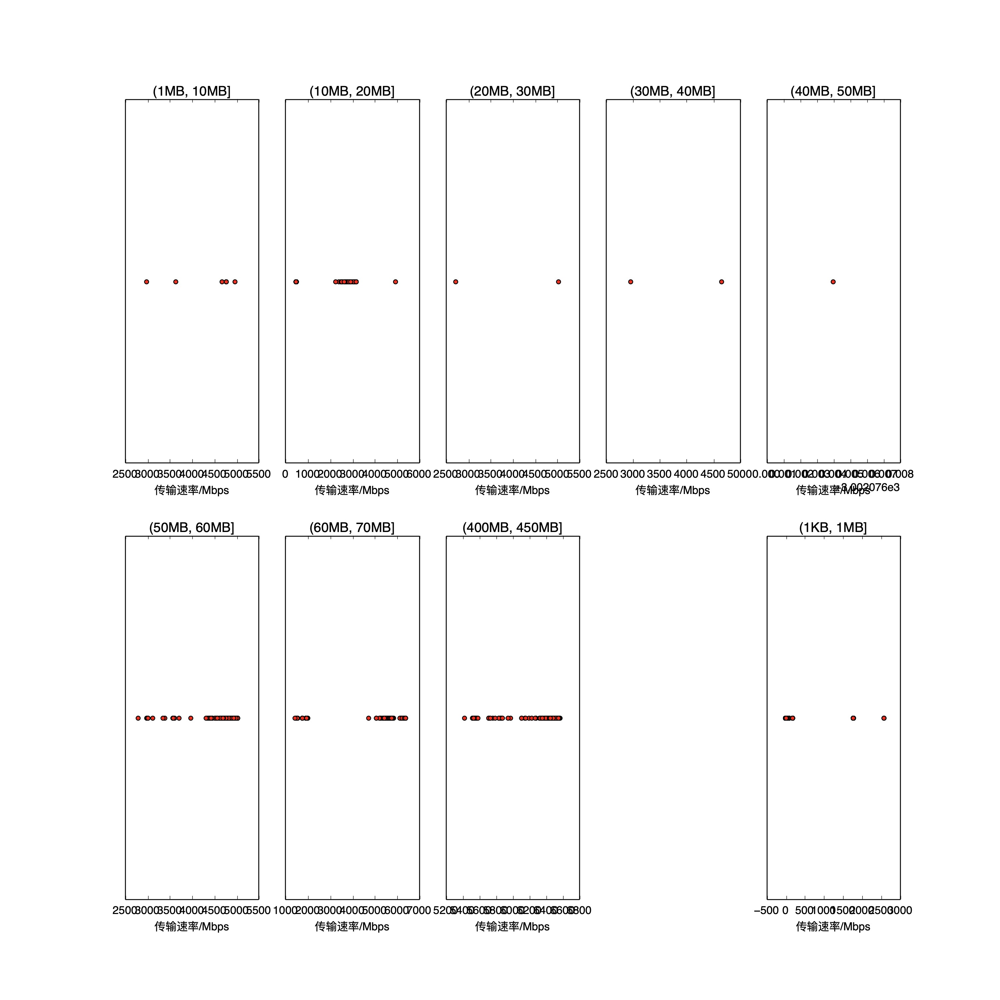

|   |个数|速率/Mbps|时间/s|时间占比|
|---|---|---|---|---|
|4Byte|200|0.00|0.00|0.00%|
|(1KB, 1MB]|258|359.22|5.61|3.81%|
|(1MB, 10MB]|7|4370.43|0.08|0.05%|
|(10MB, 20MB]|101|1399.37|26.82|18.22%|
|(20MB, 30MB]|2|3879.40|0.17|0.11%|
|(30MB, 40MB]|2|3811.93|0.22|0.15%|
|(40MB, 50MB]|1|3002.08|0.18|0.12%|
|(50MB, 60MB]|97|4520.63|14.62|9.93%|
|(60MB, 70MB]|100|4394.12|23.52|15.97%|
|(400MB, 450MB]|100|6210.04|76.02|51.63%|

