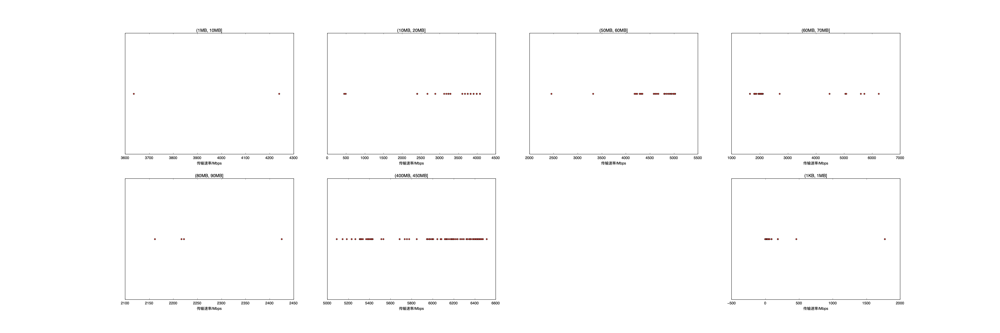

|   |个数|速率/Mbps|时间/s|时间占比|
|---|---|---|---|---|
|4Byte|200|0.00|0.00|0.00%|
|(1KB, 1MB]|178|58.50|0.91|0.65%|
|(1MB, 10MB]|2|3938.65|0.01|0.01%|
|(10MB, 20MB]|96|3608.56|6.57|4.74%|
|(50MB, 60MB]|100|4702.93|14.45|10.43%|
|(60MB, 70MB]|96|2218.48|35.40|25.56%|
|(80MB, 90MB]|4|2256.92|1.70|1.23%|
|(400MB, 450MB]|100|5953.73|79.46|57.37%|

