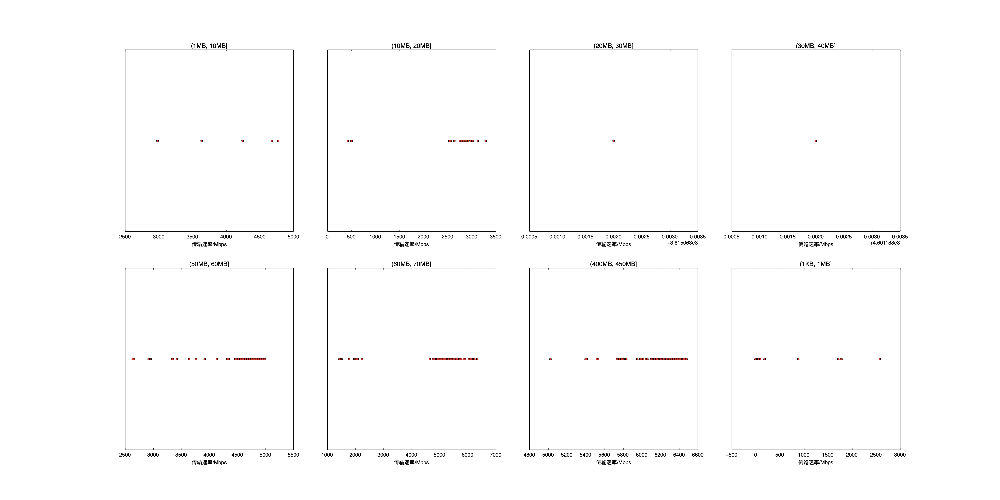

|   |个数|速率/Mbps|时间/s|时间占比|
|---|---|---|---|---|
|4Byte|200|0.00|0.00|0.00%|
|(1KB, 1MB]|255|153.07|6.25|4.27%|
|(1MB, 10MB]|8|4039.38|0.07|0.05%|
|(10MB, 20MB]|100|1171.73|28.76|19.61%|
|(20MB, 30MB]|1|3815.07|0.09|0.06%|
|(30MB, 40MB]|1|4601.19|0.08|0.05%|
|(50MB, 60MB]|99|4545.29|14.91|10.17%|
|(60MB, 70MB]|100|4673.43|20.24|13.80%|
|(400MB, 450MB]|100|6181.63|76.26|52.00%|

