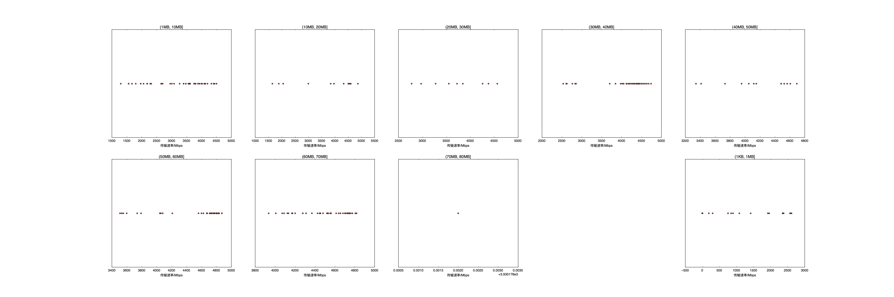

|   |个数|速率/Mbps|时间/s|时间占比|
|---|---|---|---|---|
|4Byte|200|0.00|0.00|0.00%|
|(1KB, 1MB]|36|1719.96|0.12|0.43%|
|(1MB, 10MB]|78|3386.08|1.34|4.91%|
|(10MB, 20MB]|13|3722.96|0.63|2.30%|
|(20MB, 30MB]|9|3707.49|0.68|2.48%|
|(30MB, 40MB]|81|4294.88|8.20|29.99%|
|(40MB, 50MB]|16|4232.54|1.94|7.08%|
|(50MB, 60MB]|48|4564.42|6.92|25.28%|
|(60MB, 70MB]|46|4508.97|7.32|26.77%|
|(70MB, 80MB]|1|3930.18|0.20|0.75%|

