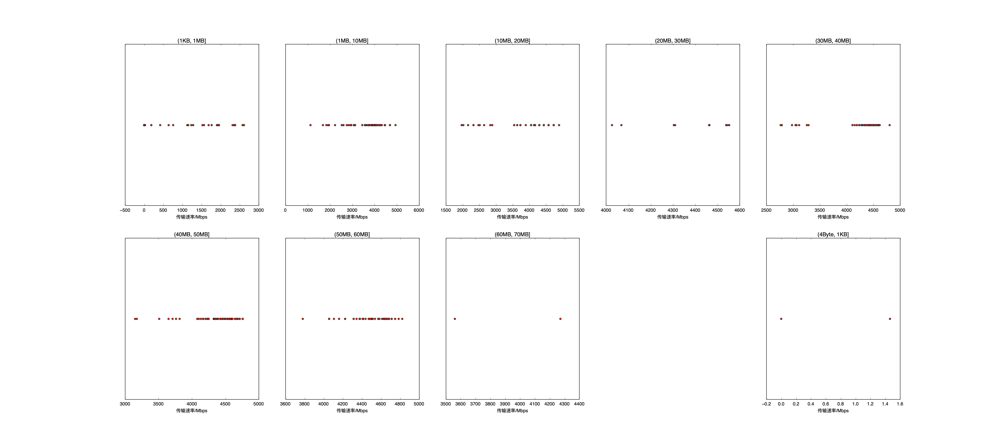

|   |个数|速率/Mbps|时间/s|时间占比|
|---|---|---|---|---|
|4Byte|200|0.00|0.00|0.00%|
|(4Byte, 1KB]|2|0.73|0.00|0.01%|
|(1KB, 1MB]|75|713.32|0.20|0.71%|
|(1MB, 10MB]|85|3724.35|1.94|7.01%|
|(10MB, 20MB]|50|3891.50|2.06|7.43%|
|(20MB, 30MB]|11|4368.06|0.65|2.36%|
|(30MB, 40MB]|57|4233.54|5.50|19.89%|
|(40MB, 50MB]|85|4422.82|10.28|37.16%|
|(50MB, 60MB]|48|4508.37|6.68|24.13%|
|(60MB, 70MB]|2|3917.28|0.36|1.30%|

