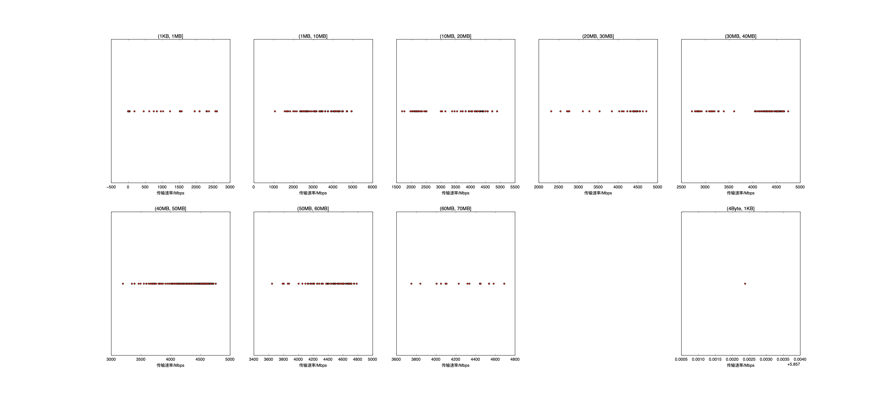

|   |个数|速率/Mbps|时间/s|时间占比|
|---|---|---|---|---|
|4Byte|600|0.00|0.00|0.00%|
|(4Byte, 1KB]|1|5.86|0.00|0.00%|
|(1KB, 1MB]|203|531.77|0.47|0.57%|
|(1MB, 10MB]|207|3745.37|4.82|5.81%|
|(10MB, 20MB]|150|3972.32|6.23|7.51%|
|(20MB, 30MB]|52|4147.77|3.32|4.00%|
|(30MB, 40MB]|144|4216.28|13.96|16.82%|
|(40MB, 50MB]|280|4412.18|34.12|41.12%|
|(50MB, 60MB]|121|4487.64|16.90|20.37%|
|(60MB, 70MB]|19|4299.62|3.16|3.80%|

