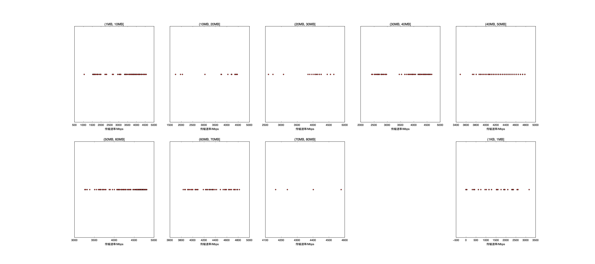

|   |个数|速率/Mbps|时间/s|时间占比|
|---|---|---|---|---|
|4Byte|600|0.00|0.00|0.00%|
|(1KB, 1MB]|147|1723.73|0.38|0.46%|
|(1MB, 10MB]|169|3405.80|3.44|4.15%|
|(10MB, 20MB]|20|3854.60|0.89|1.07%|
|(20MB, 30MB]|20|3973.05|1.43|1.72%|
|(30MB, 40MB]|97|3844.03|10.26|12.37%|
|(40MB, 50MB]|195|4395.51|22.43|27.05%|
|(50MB, 60MB]|225|4483.79|32.81|39.57%|
|(60MB, 70MB]|61|4350.99|10.54|12.71%|
|(70MB, 80MB]|4|4346.44|0.75|0.90%|

