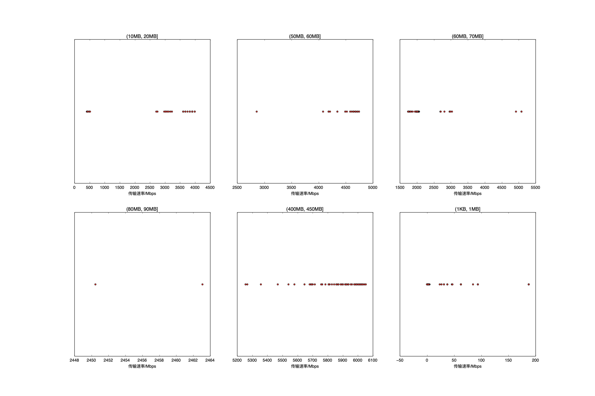

4Byte总个数: 200,  速率平均值: 0.00Mbps,  时间共: 0.00s, 百分比: 0.00%
(1KB, 1MB]总个数: 178,  速率平均值: 45.60Mbps,  时间共: 1.76s, 百分比: 1.24%
(10MB, 20MB]总个数: 98,  速率平均值: 3458.43Mbps,  时间共: 8.22s, 百分比: 5.79%
(50MB, 60MB]总个数: 100,  速率平均值: 4629.94Mbps,  时间共: 14.60s, 百分比: 10.29%
(60MB, 70MB]总个数: 98,  速率平均值: 2126.92Mbps,  时间共: 36.67s, 百分比: 25.83%
(80MB, 90MB]总个数: 2,  速率平均值: 2456.80Mbps,  时间共: 0.78s, 百分比: 0.55%
(400MB, 450MB]总个数: 100,  速率平均值: 5890.40Mbps,  时间共: 79.92s, 百分比: 56.30%

