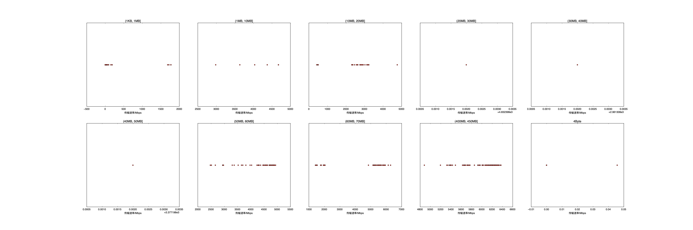

|   |个数|速率/Mbps|时间/s|时间占比|
|---|---|---|---|---|
|4Byte|200|0.00|0.00|0.00%|
|(4Byte, 1KB]|1|0.00|0.00|0.00%|
|(1KB, 1MB]|254|352.46|4.68|3.15%|
|(1MB, 10MB]|6|4065.21|0.07|0.05%|
|(10MB, 20MB]|101|1381.81|27.03|18.21%|
|(20MB, 30MB]|1|4832.40|0.05|0.03%|
|(30MB, 40MB]|1|2961.31|0.15|0.10%|
|(40MB, 50MB]|1|3377.20|0.16|0.11%|
|(50MB, 60MB]|98|4515.92|14.84|9.99%|
|(60MB, 70MB]|100|4348.26|23.04|15.53%|
|(400MB, 450MB]|100|6015.94|78.42|52.83%|

