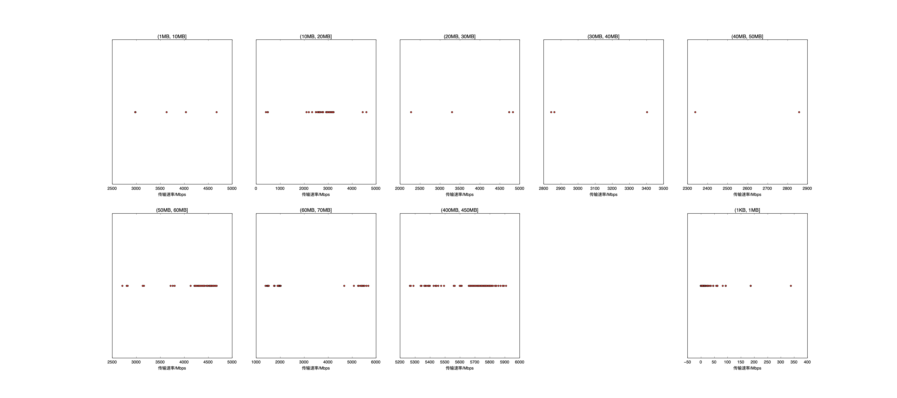

|   |个数|速率/Mbps|时间/s|时间占比|
|---|---|---|---|---|
|4Byte|201|0.00|0.00|0.00%|
|(4Byte, 1KB]|2|0.00|0.00|0.00%|
|(1KB, 1MB]|199|41.00|2.84|1.91%|
|(1MB, 10MB]|15|3280.46|0.09|0.06%|
|(10MB, 20MB]|102|2836.48|8.96|6.03%|
|(20MB, 30MB]|5|3980.10|0.40|0.27%|
|(30MB, 40MB]|3|3037.12|0.43|0.29%|
|(40MB, 50MB]|2|2599.15|0.42|0.28%|
|(50MB, 60MB]|94|4405.91|14.44|9.71%|
|(60MB, 70MB]|100|2301.85|37.91|25.49%|
|(400MB, 450MB]|100|5657.05|83.23|55.96%|

