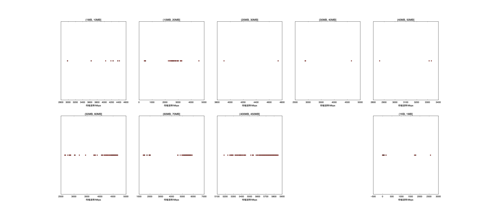

|   |个数|速率/Mbps|时间/s|时间占比|
|---|---|---|---|---|
|4Byte|600|0.00|0.00|0.00%|
|(1KB, 1MB]|694|151.99|11.57|2.56%|
|(1MB, 10MB]|22|3922.95|0.22|0.05%|
|(10MB, 20MB]|303|1954.44|60.51|13.38%|
|(20MB, 30MB]|3|4461.38|0.18|0.04%|
|(30MB, 40MB]|3|3481.98|0.37|0.08%|
|(40MB, 50MB]|3|3170.18|0.51|0.11%|
|(50MB, 60MB]|294|4373.20|45.76|10.12%|
|(60MB, 70MB]|300|3557.97|84.89|18.77%|
|(400MB, 450MB]|300|5691.16|248.17|54.88%|

