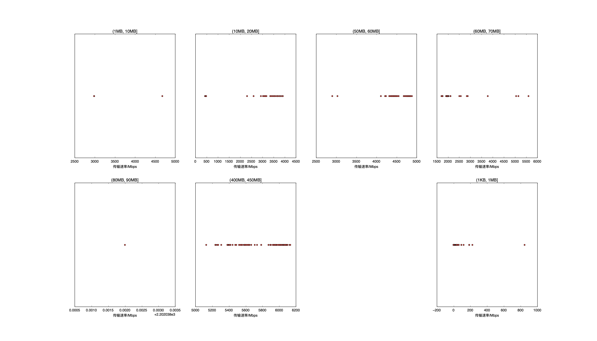

|   |个数|速率/Mbps|时间/s|时间占比|
|---|---|---|---|---|
|4Byte|200|0.00|0.00|0.00%|
|(1KB, 1MB]|172|37.51|2.46|1.71%|
|(1MB, 10MB]|3|3549.06|0.03|0.02%|
|(10MB, 20MB]|99|3465.54|7.50|5.21%|
|(50MB, 60MB]|100|4619.69|14.64|10.15%|
|(60MB, 70MB]|99|2095.24|37.77|26.20%|
|(80MB, 90MB]|1|2202.04|0.43|0.30%|
|(400MB, 450MB]|100|5798.92|81.31|56.41%|

