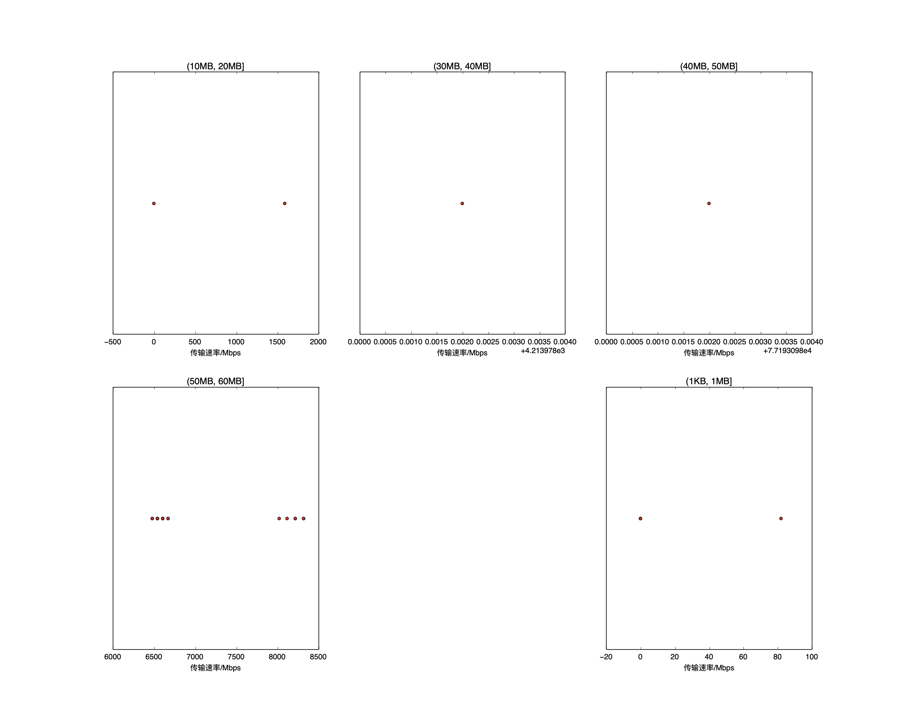

|   |个数|速率/Mbps|时间/s|时间占比|
|---|---|---|---|---|
|4Byte|200|0.00|0.00|0.00%|
|(1KB, 1MB]|7|11.72|0.00|0.01%|
|(1MB, 10MB]|3|0.00|0.00|0.00%|
|(10MB, 20MB]|2|795.36|0.08|0.85%|
|(20MB, 30MB]|2|0.00|0.00|0.00%|
|(30MB, 40MB]|1|4213.98|0.08|0.84%|
|(40MB, 50MB]|1|77193.10|0.01|0.07%|
|(50MB, 60MB]|97|6724.81|9.76|98.24%|
|(80MB, 90MB]|100|0.00|0.00|0.00%|
|(400MB, 450MB]|100|0.00|0.00|0.00%|

