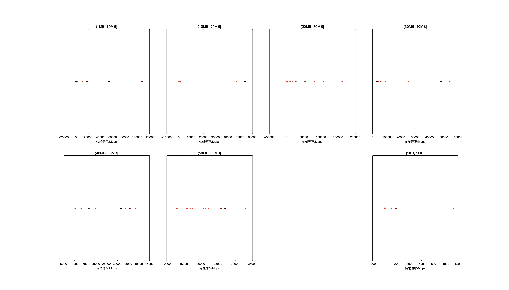

|   |个数|速率/Mbps|时间/s|时间占比|
|---|---|---|---|---|
|4Byte|200|0.00|0.00|0.00%|
|(1KB, 1MB]|120|13.76|0.14|1.27%|
|(1MB, 10MB]|55|5020.98|3.63|33.35%|
|(10MB, 20MB]|129|1045.97|2.27|20.91%|
|(20MB, 30MB]|34|29336.77|2.20|20.24%|
|(30MB, 40MB]|32|35449.29|1.06|9.77%|
|(40MB, 50MB]|28|32401.32|0.53|4.88%|
|(50MB, 60MB]|36|22789.88|1.04|9.58%|
|(60MB, 70MB]|100|0.00|0.00|0.00%|
|(400MB, 450MB]|100|0.00|0.00|0.00%|

