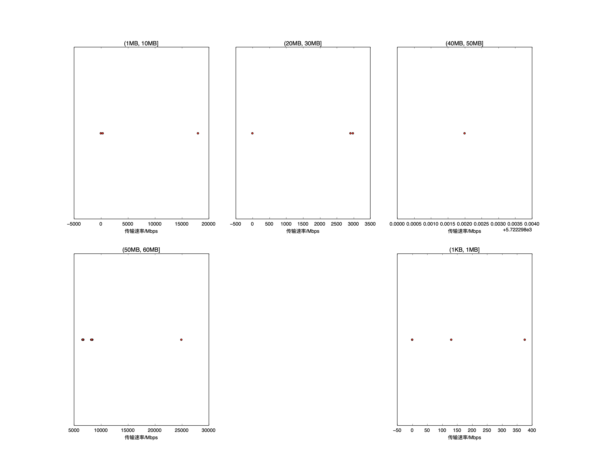

|   |个数|速率/Mbps|时间/s|时间占比|
|---|---|---|---|---|
|4Byte|200|0.00|0.00|0.00%|
|(1KB, 1MB]|6|84.43|0.63|6.01%|
|(1MB, 10MB]|4|4593.11|0.08|0.73%|
|(10MB, 20MB]|2|0.00|0.00|0.00%|
|(20MB, 30MB]|3|1965.07|0.16|1.57%|
|(30MB, 40MB]|2|0.00|0.00|0.00%|
|(40MB, 50MB]|1|5722.30|0.08|0.77%|
|(50MB, 60MB]|96|6961.48|9.50|90.93%|
|(80MB, 90MB]|100|0.00|0.00|0.00%|
|(400MB, 450MB]|100|0.00|0.00|0.00%|

