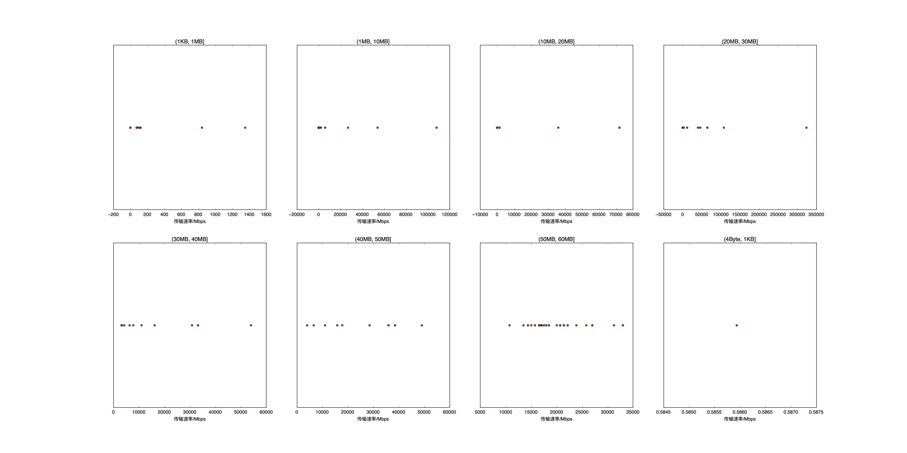

|   |个数|速率/Mbps|时间/s|时间占比|
|---|---|---|---|---|
|4Byte|200|0.00|0.00|0.00%|
|(4Byte, 1KB]|1|0.59|0.01|0.14%|
|(1KB, 1MB]|135|21.89|0.24|2.18%|
|(1MB, 10MB]|80|4352.54|5.61|51.76%|
|(10MB, 20MB]|116|2282.61|0.87|8.06%|
|(20MB, 30MB]|17|44532.04|0.65|5.96%|
|(30MB, 40MB]|16|15631.96|0.96|8.84%|
|(40MB, 50MB]|15|28614.55|0.46|4.22%|
|(50MB, 60MB]|66|21508.85|2.04|18.84%|
|(60MB, 70MB]|100|0.00|0.00|0.00%|
|(400MB, 450MB]|100|0.00|0.00|0.00%|

