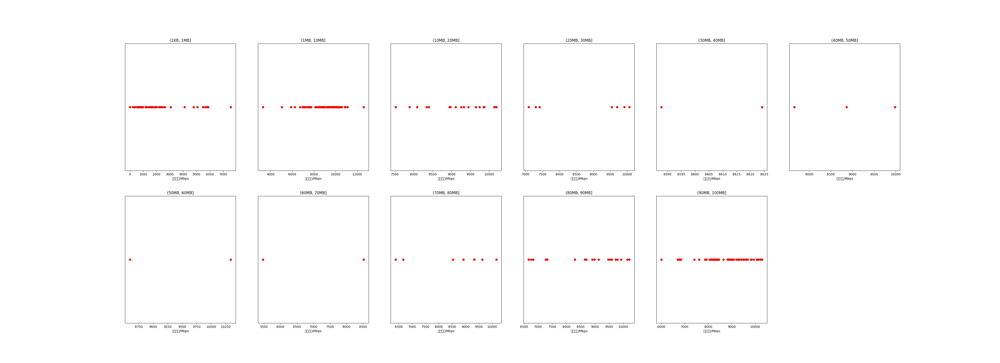

|   |个数|平均大小/MB|速率/Mbps|总时间/s|平均时间/ms|时间占比|
|---|---|---|---|---|---|---|
|(1KB, 1MB]|46|0.24|2210.27|0.06|1.33|0.44%|
|(1MB, 10MB]|84|5.06|8962.24|0.58|6.88|4.19%|
|(10MB, 20MB]|18|14.46|9163.82|0.34|18.99|2.48%|
|(20MB, 30MB]|7|23.66|8716.54|0.23|33.29|1.69%|
|(30MB, 40MB]|2|35.08|8606.07|0.10|48.92|0.71%|
|(40MB, 50MB]|3|43.72|8835.44|0.18|59.82|1.30%|
|(50MB, 60MB]|2|56.27|9468.69|0.14|71.64|1.04%|
|(60MB, 70MB]|2|63.13|6991.22|0.23|113.67|1.65%|
|(70MB, 80MB]|8|75.00|8617.03|0.86|107.01|6.21%|
|(80MB, 90MB]|20|85.94|8628.24|2.45|122.47|17.76%|
|(90MB, 100MB]|66|92.85|8652.36|8.62|130.63|62.53%|

