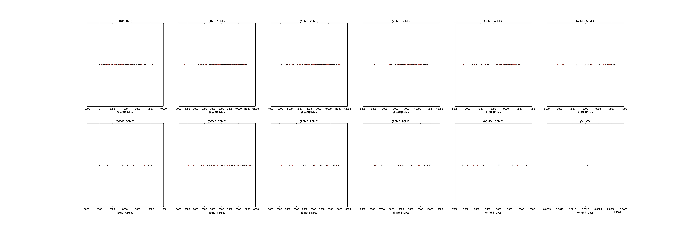

|   |个数|平均大小/MB|速率/Mbps|总时间/s|平均时间/ms|时间占比|
|---|---|---|---|---|---|---|
|(0, 1KB]|1|0.00|14.15|0.00|0.41|0.00%|
|(1KB, 1MB]|109|0.42|4265.83|0.12|1.06|0.86%|
|(1MB, 10MB]|298|4.88|8990.08|1.95|6.56|14.55%|
|(10MB, 20MB]|150|13.74|9235.57|2.71|18.09|20.20%|
|(20MB, 30MB]|57|23.85|8820.96|1.89|33.20|14.09%|
|(30MB, 40MB]|22|33.39|8648.37|1.05|47.79|7.83%|
|(40MB, 50MB]|52|44.94|8815.46|3.22|61.99|24.00%|
|(50MB, 60MB]|22|54.17|8562.55|1.69|76.87|12.59%|
|(60MB, 70MB]|9|62.62|8653.43|0.79|87.96|5.89%|

