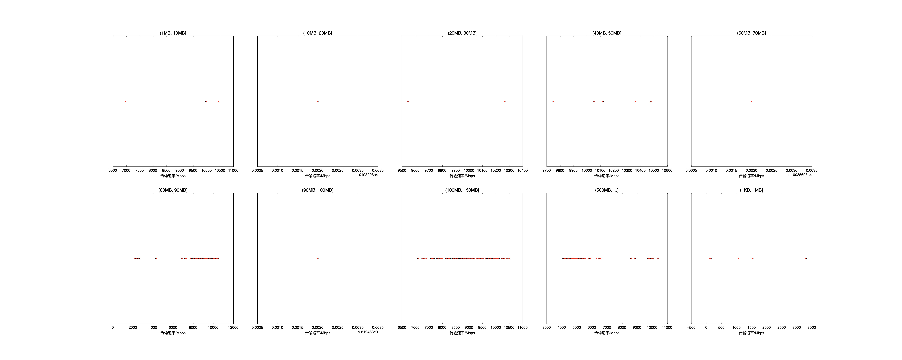

|   |个数|平均大小/MB|速率/Mbps|总时间/s|平均时间/ms|时间占比|
|---|---|---|---|---|---|---|
|(1KB, 1MB]|6|0.17|1051.21|0.01|1.66|0.01%|
|(1MB, 10MB]|3|3.38|9139.10|0.01|4.17|0.01%|
|(10MB, 20MB]|3|14.92|10001.41|0.05|18.00|0.05%|
|(20MB, 30MB]|5|27.87|10153.28|0.16|32.95|0.14%|
|(40MB, 50MB]|1|45.04|10035.70|0.05|53.85|0.05%|
|(50MB, 60MB]|96|56.16|6766.70|14.08|146.67|12.18%|
|(60MB, 70MB]|1|64.03|9812.47|0.08|78.31|0.07%|
|(70MB, 80MB]|99|79.66|8962.77|10.67|107.74|9.23%|
|(350MB, 400MB]|100|392.00|5483.86|90.44|904.44|78.26%|

