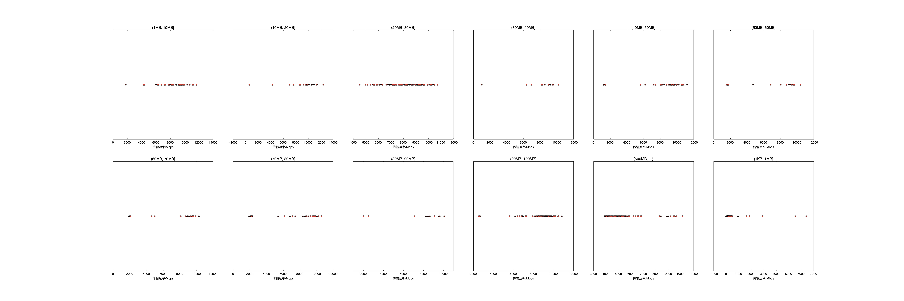

|   |个数|速率/Mbps|时间/s|时间占比|
|---|---|---|---|---|
|(1KB, 1MB]|124|377.60|0.14|0.12%|
|(1MB, 10MB]|48|8534.69|0.28|0.23%|
|(10MB, 20MB]|24|8553.72|0.97|0.82%|
|(20MB, 30MB]|105|8014.41|2.57|2.15%|
|(30MB, 40MB]|15|8239.47|0.63|0.53%|
|(40MB, 50MB]|41|7454.36|3.44|2.88%|
|(50MB, 60MB]|19|6529.64|2.23|1.87%|
|(60MB, 70MB]|23|7643.08|2.31|1.94%|
|(70MB, 80MB]|27|6738.82|3.60|3.02%|
|(80MB, 90MB]|10|7554.84|1.18|0.99%|
|(90MB, 100MB]|100|8485.76|9.76|8.19%|
|(500MB, ...)|100|5378.95|92.09|77.26%|

