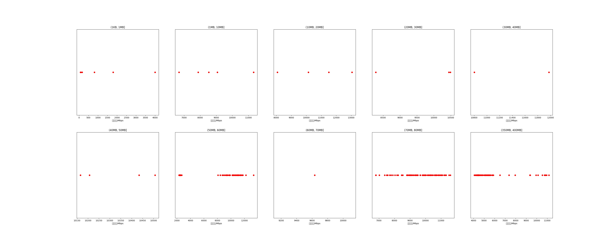

|   |个数|速率/Mbps|时间/s|时间占比|
|---|---|---|---|---|
|(1KB, 1MB]|6|1157.76|0.01|0.01%|
|(1MB, 10MB]|5|8696.41|0.03|0.03%|
|(10MB, 20MB]|4|10693.05|0.07|0.06%|
|(20MB, 30MB]|3|9739.62|0.09|0.07%|
|(30MB, 40MB]|2|11388.55|0.08|0.07%|
|(40MB, 50MB]|4|10328.55|0.22|0.19%|
|(50MB, 60MB]|93|7780.36|12.57|10.83%|
|(60MB, 70MB]|1|9633.23|0.08|0.07%|
|(70MB, 80MB]|99|9618.99|9.98|8.60%|
|(350MB, 400MB]|100|5412.89|92.97|80.08%|

