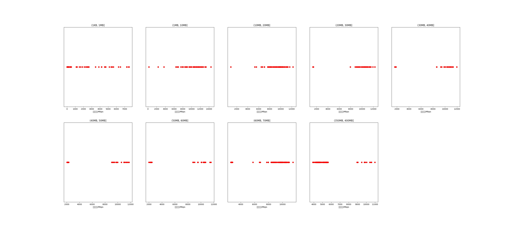

|   |个数|速率/Mbps|时间/s|时间占比|
|---|---|---|---|---|
|(1KB, 1MB]|153|978.33|0.39|0.32%|
|(1MB, 10MB]|60|10058.12|0.59|0.49%|
|(10MB, 20MB]|123|9300.31|2.75|2.30%|
|(20MB, 30MB]|52|9670.79|2.43|2.03%|
|(30MB, 40MB]|26|8385.85|2.38|1.99%|
|(40MB, 50MB]|26|6921.26|3.65|3.05%|
|(50MB, 60MB]|26|7436.93|3.58|2.99%|
|(60MB, 70MB]|100|8676.09|10.77|9.00%|
|(350MB, 400MB]|100|5378.06|93.07|77.82%|

