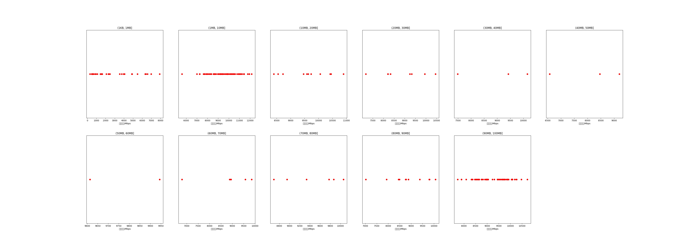

|   |个数|平均大小/MB|速率/Mbps|总时间/s|平均时间/ms|时间占比|
|---|---|---|---|---|---|---|
|(1KB, 1MB]|34|0.31|2747.28|0.04|1.26|0.34%|
|(1MB, 10MB]|93|4.42|9489.68|0.52|5.60|4.08%|
|(10MB, 20MB]|11|15.55|9629.16|0.22|19.59|1.69%|
|(20MB, 30MB]|8|25.38|8861.49|0.28|34.78|2.18%|
|(30MB, 40MB]|3|35.27|9022.04|0.14|48.16|1.13%|
|(40MB, 50MB]|3|41.88|8079.28|0.19|63.47|1.49%|
|(50MB, 60MB]|2|53.63|9778.78|0.13|65.80|1.03%|
|(60MB, 70MB]|6|65.95|8827.43|0.55|91.19|4.28%|
|(70MB, 80MB]|6|75.21|9446.81|0.57|95.81|4.50%|
|(80MB, 90MB]|11|86.30|8851.71|1.30|118.02|10.16%|
|(90MB, 100MB]|73|93.40|9313.05|8.83|121.02|69.13%|

