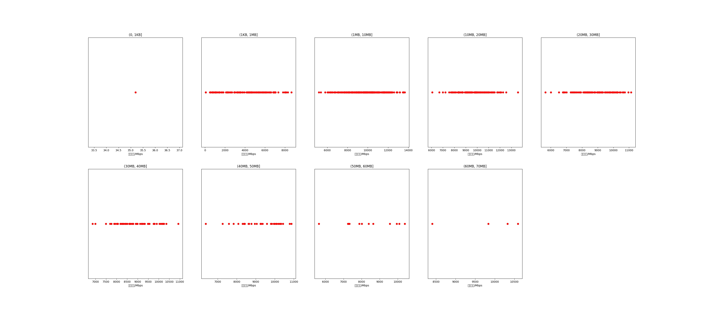

|   |个数|平均大小/MB|速率/Mbps|总时间/s|平均时间/ms|时间占比|
|---|---|---|---|---|---|---|
|(0, 1KB]|1|0.00|35.19|0.00|0.33|0.00%|
|(1KB, 1MB]|133|0.42|4091.08|0.15|1.10|1.12%|
|(1MB, 10MB]|294|4.62|9812.90|1.66|5.63|12.69%|
|(10MB, 20MB]|118|14.12|9670.58|2.11|17.87|16.16%|
|(20MB, 30MB]|98|24.46|8826.91|3.32|33.83|25.40%|
|(30MB, 40MB]|55|35.76|8887.46|2.69|48.87|20.60%|
|(40MB, 50MB]|32|43.39|9198.49|1.84|57.49|14.10%|
|(50MB, 60MB]|12|55.54|8364.43|0.98|82.04|7.54%|
|(60MB, 70MB]|4|62.90|9788.43|0.31|77.74|2.38%|

