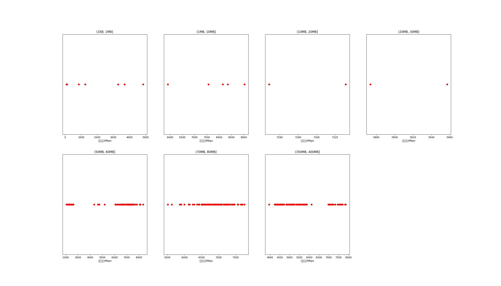

|   |个数|平均大小/MB|速率/Mbps|总时间/s|平均时间/ms|时间占比|
|---|---|---|---|---|---|---|
|(1KB, 1MB]|7|0.23|2022.55|0.01|1.23|0.01%|
|(1MB, 10MB]|5|4.25|7799.24|0.03|6.27|0.03%|
|(10MB, 20MB]|2|18.01|7290.06|0.06|29.65|0.05%|
|(20MB, 30MB]|2|28.08|5915.15|0.11|56.99|0.10%|
|(50MB, 60MB]|98|56.14|5931.40|13.75|140.26|11.81%|
|(70MB, 80MB]|100|79.66|6844.81|14.03|140.27|12.05%|
|(350MB, 400MB]|100|392.00|5499.82|88.39|883.89|75.95%|

