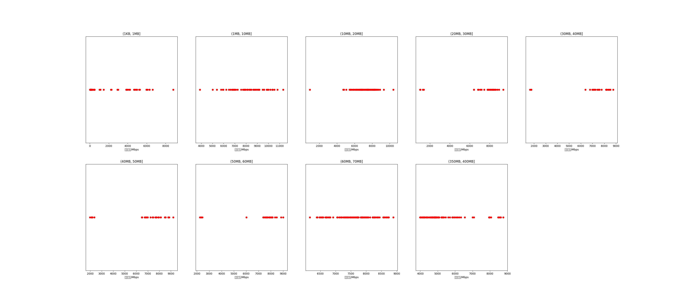

|   |个数|平均大小/MB|速率/Mbps|总时间/s|平均时间/ms|时间占比|
|---|---|---|---|---|---|---|
|(1KB, 1MB]|145|0.15|983.76|0.29|2.01|0.24%|
|(1MB, 10MB]|60|5.74|8161.44|0.53|8.79|0.44%|
|(10MB, 20MB]|122|15.63|7144.87|3.46|28.33|2.89%|
|(20MB, 30MB]|35|25.23|7205.85|2.16|61.72|1.81%|
|(30MB, 40MB]|27|36.23|6815.87|2.31|85.41|1.93%|
|(40MB, 50MB]|35|47.27|6458.51|4.15|118.53|3.47%|
|(50MB, 60MB]|26|53.59|7031.00|2.92|112.45|2.45%|
|(60MB, 70MB]|100|64.00|7609.64|10.17|101.66|8.50%|
|(350MB, 400MB]|100|392.00|5234.57|93.56|935.61|78.27%|

