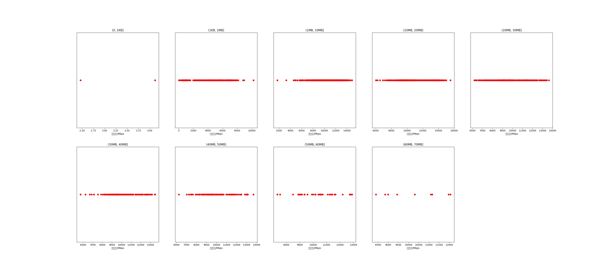

|   |个数|平均大小/MB|速率/Mbps|总时间/s|平均时间/ms|时间占比|
|---|---|---|---|---|---|---|
|(0, 1KB]|2|0.00|3.29|0.01|2.61|0.01%|
|(1KB, 1MB]|312|0.46|4293.50|0.39|1.24|1.08%|
|(1MB, 10MB]|887|5.04|10417.94|5.12|5.77|14.39%|
|(10MB, 20MB]|394|13.75|10847.36|6.21|15.76|17.46%|
|(20MB, 30MB]|286|24.77|9686.35|9.06|31.68|25.48%|
|(30MB, 40MB]|123|35.54|10084.25|5.35|43.52|15.05%|
|(40MB, 50MB]|119|43.64|10017.95|6.38|53.61|17.94%|
|(50MB, 60MB]|37|54.10|10293.01|2.38|64.30|6.69%|
|(60MB, 70MB]|9|62.61|10249.47|0.67|74.51|1.89%|

