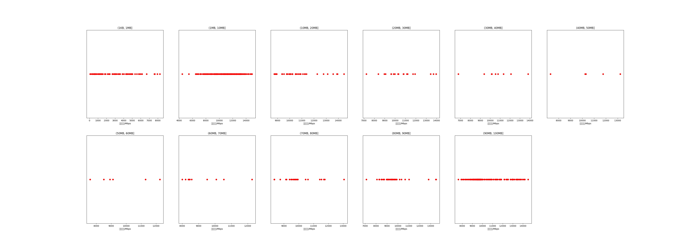

|   |个数|平均大小/MB|速率/Mbps|总时间/s|平均时间/ms|时间占比|
|---|---|---|---|---|---|---|
|(1KB, 1MB]|86|0.29|2795.34|0.10|1.19|0.29%|
|(1MB, 10MB]|257|4.59|10841.78|1.32|5.15|3.76%|
|(10MB, 20MB]|41|14.61|10591.91|0.70|16.96|1.97%|
|(20MB, 30MB]|20|24.57|10617.60|0.57|28.70|1.63%|
|(30MB, 40MB]|9|33.78|10562.06|0.36|40.07|1.02%|
|(40MB, 50MB]|5|43.35|10568.14|0.25|50.99|0.72%|
|(50MB, 60MB]|6|54.53|9612.09|0.42|69.75|1.19%|
|(60MB, 70MB]|10|65.46|9244.64|0.86|86.43|2.45%|
|(70MB, 80MB]|22|75.38|10057.77|2.01|91.18|5.69%|
|(80MB, 90MB]|46|85.54|9542.35|5.01|108.89|14.21%|
|(90MB, 100MB]|213|93.22|10275.66|23.64|110.97|67.06%|

