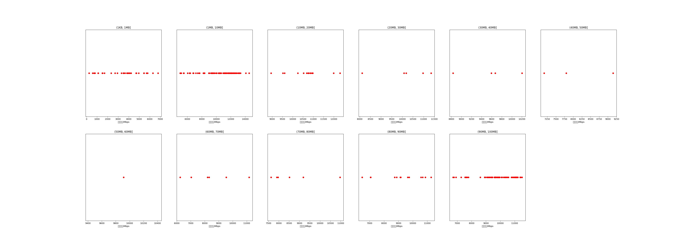

|   |个数|平均大小/MB|速率/Mbps|总时间/s|平均时间/ms|时间占比|
|---|---|---|---|---|---|---|
|(1KB, 1MB]|31|0.33|3391.71|0.03|1.10|0.28%|
|(1MB, 10MB]|95|4.40|10385.60|0.51|5.36|4.09%|
|(10MB, 20MB]|14|14.92|10645.44|0.24|17.08|1.92%|
|(20MB, 30MB]|5|24.03|10140.03|0.14|28.64|1.15%|
|(30MB, 40MB]|4|31.25|9575.44|0.16|39.29|1.26%|
|(40MB, 50MB]|3|44.62|8035.72|0.20|67.77|1.63%|
|(50MB, 60MB]|1|51.17|9912.13|0.06|61.95|0.50%|
|(60MB, 70MB]|6|65.23|8413.62|0.58|96.36|4.64%|
|(70MB, 80MB]|6|76.77|8691.67|0.65|107.54|5.18%|
|(80MB, 90MB]|13|85.46|9176.61|1.50|115.37|12.05%|
|(90MB, 100MB]|72|93.32|9790.81|8.38|116.34|67.29%|

