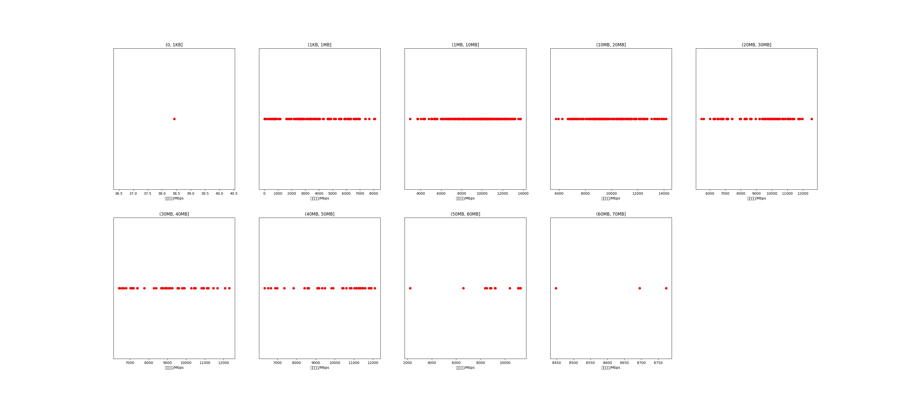

|   |个数|平均大小/MB|速率/Mbps|总时间/s|平均时间/ms|时间占比|
|---|---|---|---|---|---|---|
|(0, 1KB]|1|0.00|38.42|0.00|0.30|0.00%|
|(1KB, 1MB]|121|0.41|3577.14|0.17|1.37|1.27%|
|(1MB, 10MB]|280|4.37|9501.48|1.57|5.61|12.02%|
|(10MB, 20MB]|152|13.65|10060.14|2.58|16.97|19.75%|
|(20MB, 30MB]|87|25.33|9206.88|3.00|34.47|22.95%|
|(30MB, 40MB]|47|35.27|9060.84|2.29|48.65|17.50%|
|(40MB, 50MB]|37|43.32|9801.75|2.04|55.08|15.60%|
|(50MB, 60MB]|14|53.53|9140.76|1.16|83.05|8.90%|
|(60MB, 70MB]|3|62.90|8638.61|0.26|87.40|2.01%|

