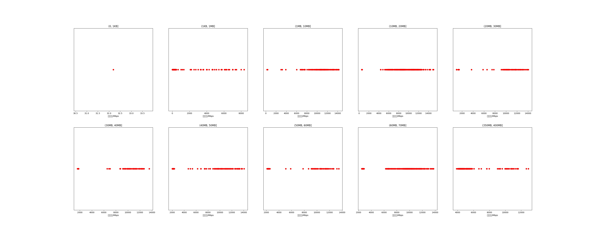

|   |个数|平均大小/MB|速率/Mbps|总时间/s|平均时间/ms|时间占比|
|---|---|---|---|---|---|---|
|(0, 1KB]|1|0.00|32.19|0.00|0.27|0.00%|
|(1KB, 1MB]|384|0.08|623.85|0.81|2.12|0.23%|
|(1MB, 10MB]|167|5.39|10695.97|1.47|8.79|0.41%|
|(10MB, 20MB]|384|15.19|9392.35|8.42|21.94|2.35%|
|(20MB, 30MB]|84|23.39|9790.59|4.17|49.63|1.16%|
|(30MB, 40MB]|74|36.02|9197.87|5.59|75.51|1.56%|
|(40MB, 50MB]|127|47.08|8108.94|14.86|117.05|4.15%|
|(50MB, 60MB]|79|52.87|8066.69|9.93|125.71|2.77%|
|(60MB, 70MB]|300|64.00|9301.92|28.85|96.15|8.06%|
|(350MB, 400MB]|300|392.00|5313.31|283.97|946.56|79.30%|

