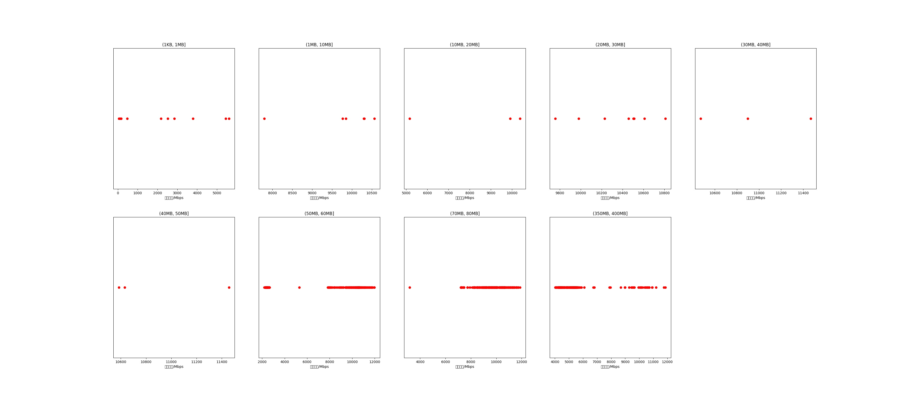

|   |个数|平均大小/MB|速率/Mbps|总时间/s|平均时间/ms|时间占比|
|---|---|---|---|---|---|---|
|(1KB, 1MB]|11|0.16|2120.30|0.01|1.00|0.00%|
|(1MB, 10MB]|6|4.63|9765.22|0.03|5.51|0.01%|
|(10MB, 20MB]|3|15.72|8482.36|0.07|22.84|0.02%|
|(20MB, 30MB]|9|26.20|10373.99|0.27|30.36|0.08%|
|(30MB, 40MB]|3|36.74|10946.17|0.12|40.29|0.03%|
|(40MB, 50MB]|3|48.03|10891.43|0.16|52.95|0.05%|
|(50MB, 60MB]|290|56.15|7210.21|42.58|146.83|12.19%|
|(70MB, 80MB]|300|79.66|9764.16|29.86|99.54|8.55%|
|(350MB, 400MB]|300|392.00|5424.56|276.10|920.34|79.06%|

