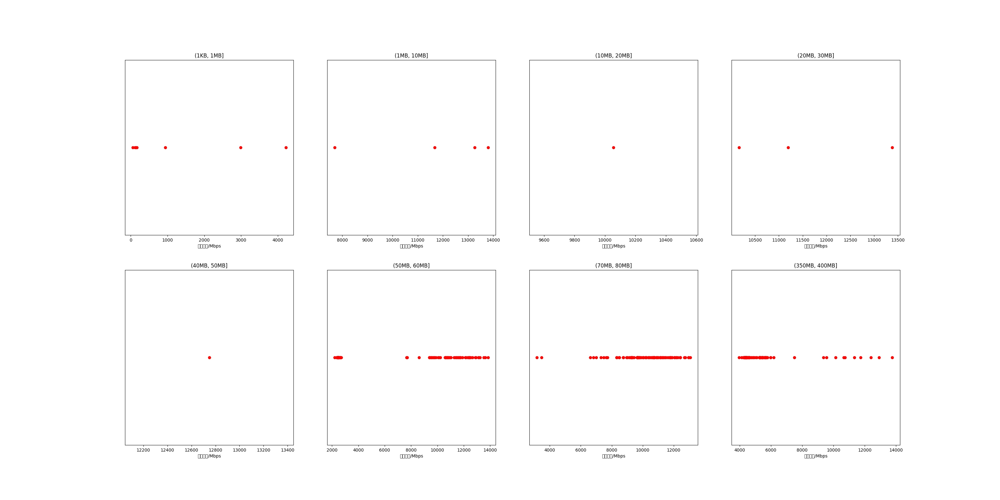

|   |个数|平均大小/MB|速率/Mbps|总时间/s|平均时间/ms|时间占比|
|---|---|---|---|---|---|---|
|(1KB, 1MB]|7|0.14|1232.68|0.01|1.09|0.01%|
|(1MB, 10MB]|4|4.19|11613.10|0.02|4.05|0.01%|
|(10MB, 20MB]|1|18.01|10056.80|0.02|21.49|0.02%|
|(20MB, 30MB]|3|27.73|11580.80|0.09|29.12|0.08%|
|(40MB, 50MB]|1|49.54|12748.10|0.05|46.63|0.04%|
|(50MB, 60MB]|97|56.16|7625.91|14.17|146.08|12.26%|
|(70MB, 80MB]|100|79.66|10182.79|9.85|98.46|8.52%|
|(350MB, 400MB]|100|392.00|5561.69|91.38|913.82|79.07%|

