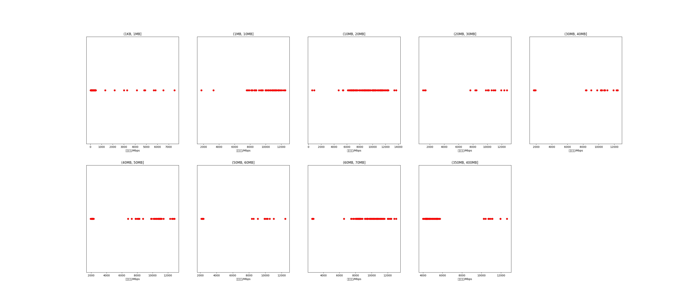

|   |个数|平均大小/MB|速率/Mbps|总时间/s|平均时间/ms|时间占比|
|---|---|---|---|---|---|---|
|(1KB, 1MB]|124|0.08|592.90|0.20|1.62|0.17%|
|(1MB, 10MB]|61|5.78|10051.13|0.44|7.14|0.37%|
|(10MB, 20MB]|132|15.18|9102.83|3.15|23.87|2.65%|
|(20MB, 30MB]|18|22.79|8844.98|1.13|62.67|0.95%|
|(30MB, 40MB]|23|36.13|9063.74|1.77|77.03|1.49%|
|(40MB, 50MB]|55|47.69|7775.53|6.71|122.07|5.65%|
|(50MB, 60MB]|18|52.94|6589.17|2.86|158.75|2.41%|
|(60MB, 70MB]|100|64.00|9412.63|9.20|92.01|7.75%|
|(350MB, 400MB]|100|392.00|5462.22|93.31|933.11|78.56%|

