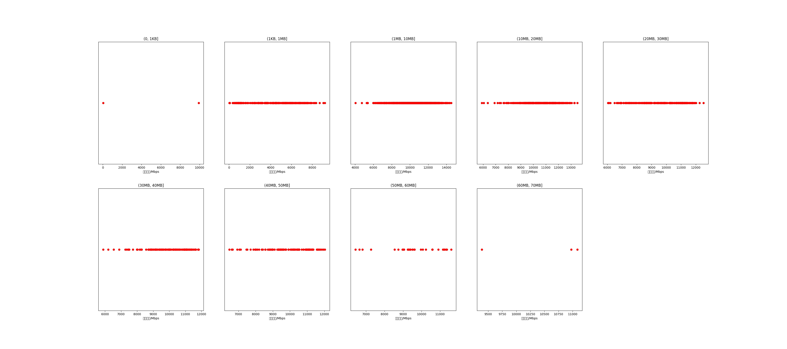

|   |个数|平均大小/MB|速率/Mbps|总时间/s|平均时间/ms|时间占比|
|---|---|---|---|---|---|---|
|(0, 1KB]|2|0.00|4977.78|0.01|3.49|0.02%|
|(1KB, 1MB]|344|0.45|4430.89|0.38|1.10|1.06%|
|(1MB, 10MB]|992|4.63|10394.16|5.24|5.28|14.60%|
|(10MB, 20MB]|392|13.55|10482.06|6.20|15.82|17.28%|
|(20MB, 30MB]|291|24.95|9662.14|9.27|31.85|25.81%|
|(30MB, 40MB]|138|35.32|9921.29|6.01|43.54|16.74%|
|(40MB, 50MB]|119|43.65|9888.10|6.43|54.07|17.92%|
|(50MB, 60MB]|31|53.93|9585.01|2.14|69.11|5.97%|
|(60MB, 70MB]|3|62.90|10482.67|0.22|72.42|0.61%|

