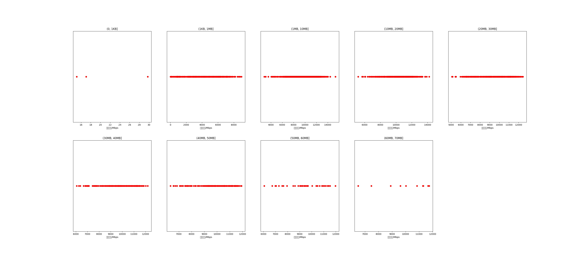

|   |个数|平均大小/MB|速率/Mbps|总时间/s|平均时间/ms|时间占比|
|---|---|---|---|---|---|---|
|(0, 1KB]|3|0.00|20.63|0.00|0.42|0.00%|
|(1KB, 1MB]|600|0.45|4310.73|0.71|1.18|1.15%|
|(1MB, 10MB]|1576|4.56|9897.13|8.60|5.46|13.97%|
|(10MB, 20MB]|659|13.79|10314.30|10.85|16.46|17.62%|
|(20MB, 30MB]|504|24.89|9420.41|16.52|32.79|26.85%|
|(30MB, 40MB]|220|35.66|9651.58|10.00|45.44|16.24%|
|(40MB, 50MB]|209|43.42|9821.75|11.32|54.17|18.39%|
|(50MB, 60MB]|39|54.03|9379.94|2.76|70.89|4.49%|
|(60MB, 70MB]|10|62.39|9933.11|0.78|78.31|1.27%|

