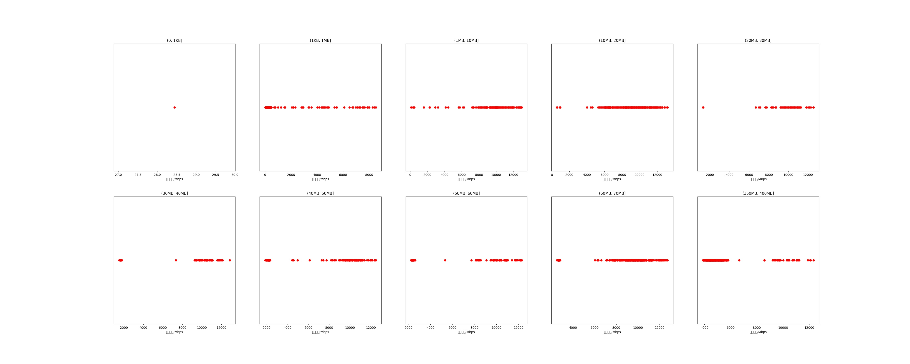

|   |个数|平均大小/MB|速率/Mbps|总时间/s|平均时间/ms|时间占比|
|---|---|---|---|---|---|---|
|(0, 1KB]|1|0.00|28.44|0.00|0.10|0.00%|
|(1KB, 1MB]|386|0.10|860.79|0.52|1.35|0.15%|
|(1MB, 10MB]|203|5.40|9631.23|2.47|12.18|0.69%|
|(10MB, 20MB]|373|15.39|8915.24|9.24|24.78|2.58%|
|(20MB, 30MB]|64|24.83|9849.79|2.35|36.68|0.65%|
|(30MB, 40MB]|56|36.24|8841.74|4.52|80.71|1.26%|
|(40MB, 50MB]|133|47.62|7962.20|15.16|113.99|4.23%|
|(50MB, 60MB]|89|53.00|7352.75|12.23|137.37|3.41%|
|(60MB, 70MB]|300|64.00|9119.09|29.47|98.24|8.22%|
|(350MB, 400MB]|300|392.00|5334.24|282.78|942.60|78.83%|

