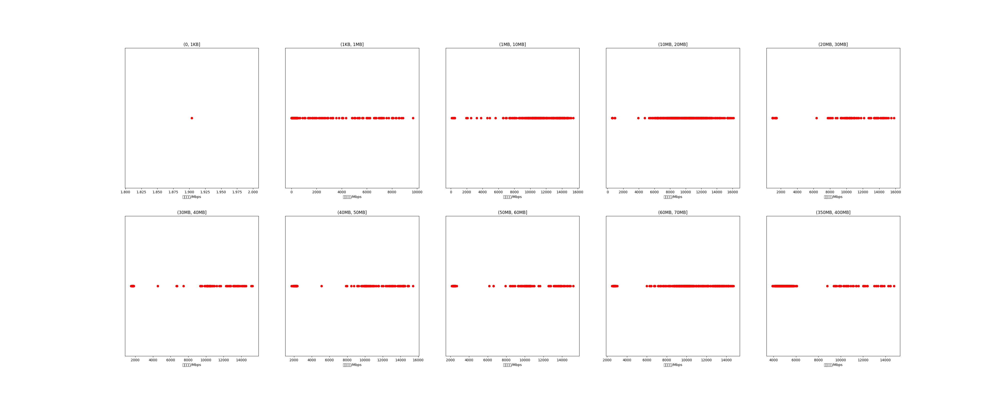

|   |个数|平均大小/MB|速率/Mbps|总时间/s|平均时间/ms|时间占比|
|---|---|---|---|---|---|---|
|(0, 1KB]|1|0.00|1.90|0.00|4.62|0.00%|
|(1KB, 1MB]|671|0.09|806.90|1.32|1.97|0.22%|
|(1MB, 10MB]|327|5.36|11065.20|3.82|11.69|0.64%|
|(10MB, 20MB]|620|15.38|9802.68|13.95|22.49|2.33%|
|(20MB, 30MB]|116|24.20|10212.12|6.22|53.59|1.04%|
|(30MB, 40MB]|103|36.16|9219.57|9.24|89.73|1.55%|
|(40MB, 50MB]|183|47.19|7889.32|24.77|135.35|4.14%|
|(50MB, 60MB]|177|53.06|7927.35|24.15|136.43|4.04%|
|(60MB, 70MB]|500|64.00|9909.77|47.49|94.98|7.94%|
|(350MB, 400MB]|500|392.00|5461.75|466.98|933.97|78.10%|

