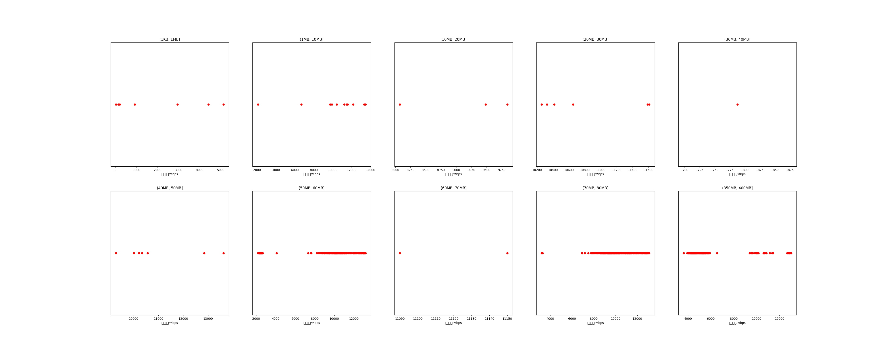

|   |个数|平均大小/MB|速率/Mbps|总时间/s|平均时间/ms|时间占比|
|---|---|---|---|---|---|---|
|(1KB, 1MB]|7|0.27|1968.88|0.02|2.71|0.01%|
|(1MB, 10MB]|11|5.98|10185.09|0.08|6.99|0.02%|
|(10MB, 20MB]|3|16.43|9134.27|0.07|21.70|0.02%|
|(20MB, 30MB]|6|26.58|10806.68|0.18|29.51|0.05%|
|(30MB, 40MB]|1|36.02|1787.79|0.24|241.80|0.07%|
|(40MB, 50MB]|7|48.52|10984.58|0.38|53.94|0.11%|
|(50MB, 60MB]|289|56.15|7667.30|41.05|142.03|11.77%|
|(60MB, 70MB]|2|64.02|11119.95|0.14|69.08|0.04%|
|(70MB, 80MB]|298|79.66|10144.61|28.85|96.82|8.27%|
|(350MB, 400MB]|300|392.00|5475.49|277.75|925.83|79.64%|

