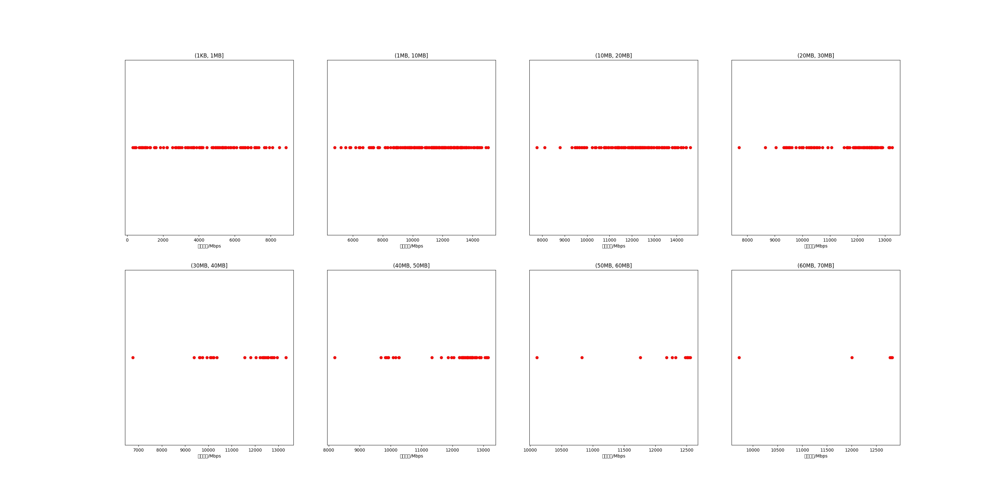

|   |个数|平均大小/MB|速率/Mbps|总时间/s|平均时间/ms|时间占比|
|---|---|---|---|---|---|---|
|(1KB, 1MB]|101|0.47|4298.89|0.13|1.25|1.24%|
|(1MB, 10MB]|209|4.93|11140.89|1.10|5.24|10.80%|
|(10MB, 20MB]|127|13.63|12013.92|1.76|13.88|17.37%|
|(20MB, 30MB]|98|24.17|11558.35|2.49|25.38|24.50%|
|(30MB, 40MB]|29|36.34|11390.14|1.14|39.26|11.22%|
|(40MB, 50MB]|58|43.98|12048.65|2.57|44.29|25.31%|
|(50MB, 60MB]|12|54.63|12047.06|0.66|54.59|6.45%|
|(60MB, 70MB]|5|62.39|12024.59|0.32|63.01|3.10%|

