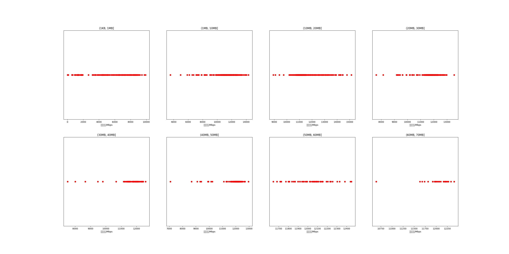

|   |个数|平均大小/MB|速率/Mbps|总时间/s|平均时间/ms|时间占比|
|---|---|---|---|---|---|---|
|(1KB, 1MB]|238|0.44|5317.20|0.22|0.92|0.73%|
|(1MB, 10MB]|361|4.79|11317.30|1.84|5.09|6.10%|
|(10MB, 20MB]|321|14.04|11590.07|4.70|14.63|15.59%|
|(20MB, 30MB]|353|23.29|11701.23|8.47|23.99|28.11%|
|(30MB, 40MB]|83|35.70|11646.40|3.08|37.05|10.21%|
|(40MB, 50MB]|157|44.30|11876.32|7.06|44.99|23.45%|
|(50MB, 60MB]|60|54.63|12016.97|3.27|54.56|10.87%|
|(60MB, 70MB]|24|62.10|11990.92|1.49|62.19|4.95%|

