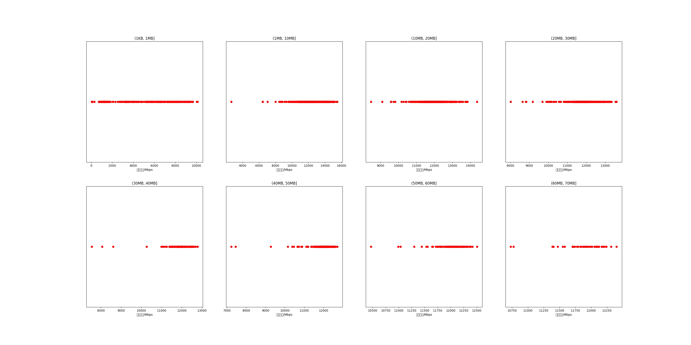

|   |个数|平均大小/MB|速率/Mbps|总时间/s|平均时间/ms|时间占比|
|---|---|---|---|---|---|---|
|(1KB, 1MB]|364|0.44|5281.44|0.32|0.87|0.64%|
|(1MB, 10MB]|661|4.85|12225.36|3.16|4.78|6.41%|
|(10MB, 20MB]|592|14.34|11943.56|8.55|14.44|17.33%|
|(20MB, 30MB]|514|23.68|11872.46|12.36|24.05|25.07%|
|(30MB, 40MB]|136|36.02|11874.12|4.97|36.55|10.08%|
|(40MB, 50MB]|255|44.20|11928.69|11.38|44.62|23.07%|
|(50MB, 60MB]|108|54.60|12008.53|5.90|54.60|11.96%|
|(60MB, 70MB]|43|61.66|11887.89|2.68|62.31|5.43%|

