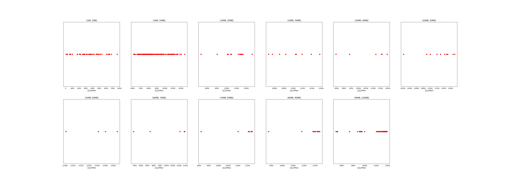

|   |个数|平均大小/MB|速率/Mbps|总时间/s|平均时间/ms|时间占比|
|---|---|---|---|---|---|---|
|(1KB, 1MB]|55|0.39|3396.97|0.07|1.31|0.23%|
|(1MB, 10MB]|278|3.43|8352.25|1.37|4.93|4.40%|
|(10MB, 20MB]|16|14.33|10825.17|0.26|16.37|0.84%|
|(20MB, 30MB]|9|23.04|10983.56|0.23|25.12|0.73%|
|(30MB, 40MB]|6|33.02|10699.08|0.23|37.58|0.73%|
|(40MB, 50MB]|11|46.21|11268.67|0.54|49.33|1.75%|
|(50MB, 60MB]|4|54.74|11559.18|0.23|56.83|0.73%|
|(60MB, 70MB]|6|65.28|10249.89|0.47|78.57|1.52%|
|(70MB, 80MB]|9|75.32|11275.99|0.73|80.71|2.34%|
|(80MB, 90MB]|16|84.77|11394.65|1.43|89.44|4.60%|
|(90MB, 100MB]|260|94.17|11561.58|25.54|98.24|82.14%|

