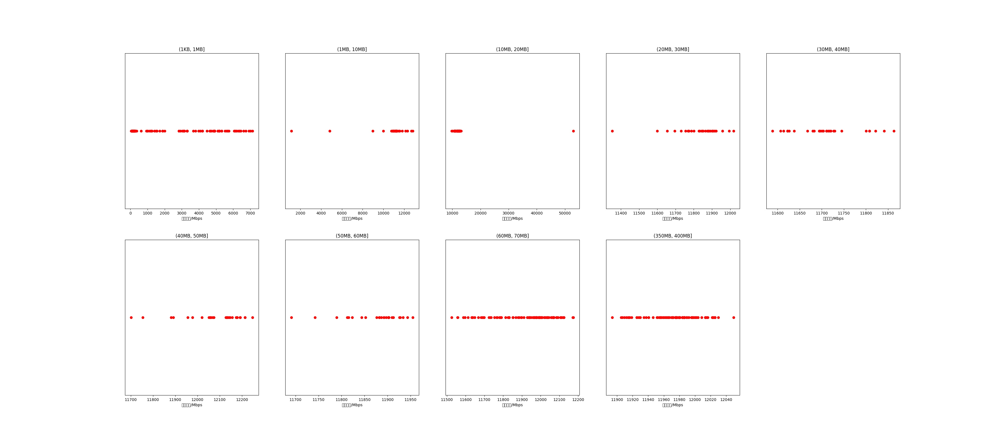

|   |个数|平均大小/MB|速率/Mbps|总时间/s|平均时间/ms|时间占比|
|---|---|---|---|---|---|---|
|(1KB, 1MB]|196|0.20|1466.77|0.29|1.47|0.54%|
|(1MB, 10MB]|36|7.70|10766.27|0.31|8.68|0.59%|
|(10MB, 20MB]|132|16.13|12201.24|2.15|16.28|4.04%|
|(20MB, 30MB]|31|27.65|11825.73|0.87|28.05|1.63%|
|(30MB, 40MB]|29|37.79|11708.97|1.12|38.73|2.11%|
|(40MB, 50MB]|29|46.39|12077.64|1.34|46.10|2.51%|
|(50MB, 60MB]|26|55.31|11872.90|1.45|55.90|2.73%|
|(60MB, 70MB]|100|64.00|11917.77|6.45|64.45|12.10%|
|(350MB, 400MB]|100|392.00|11974.25|39.28|392.85|73.76%|

