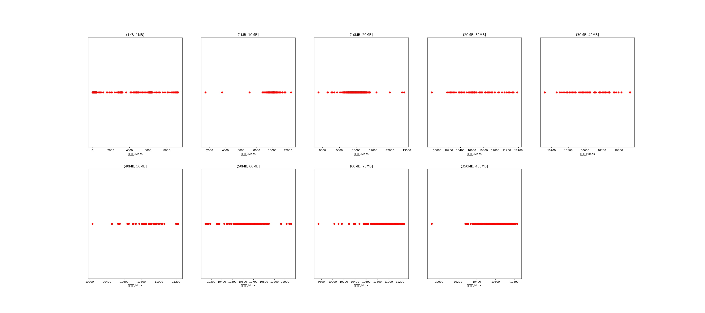

|   |个数|平均大小/MB|速率/Mbps|总时间/s|平均时间/ms|时间占比|
|---|---|---|---|---|---|---|
|(1KB, 1MB]|544|0.15|1753.50|0.47|0.86|0.26%|
|(1MB, 10MB]|99|6.00|9962.33|0.73|7.37|0.41%|
|(10MB, 20MB]|359|15.96|9993.10|6.89|19.20|3.85%|
|(20MB, 30MB]|74|25.80|10682.66|2.14|28.95|1.20%|
|(30MB, 40MB]|76|37.26|10625.58|3.20|42.09|1.79%|
|(40MB, 50MB]|52|46.77|10844.53|2.69|51.77|1.50%|
|(50MB, 60MB]|145|54.98|10640.43|8.99|62.01|5.02%|
|(60MB, 70MB]|300|64.00|10948.40|21.05|70.17|11.76%|
|(350MB, 400MB]|300|392.00|10628.84|132.79|442.62|74.20%|

